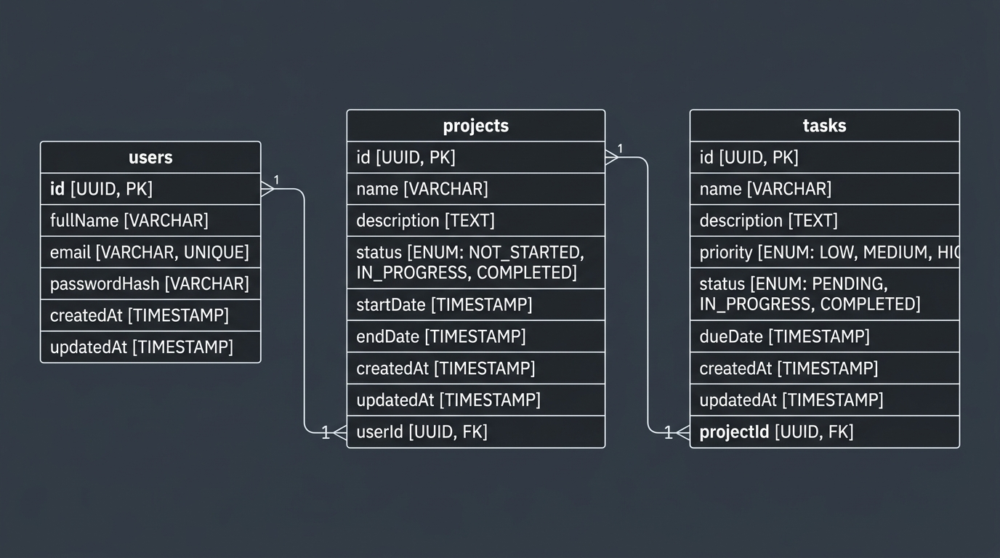

# TaskPulse — Full-Stack Project Management System

> A cross-platform project and task management system built with Node.js/Express, React (Vite), React Native (Expo), and PostgreSQL via Prisma ORM.

---

## 📌 Project Architecture

```
web_mobile/
├── backend/                   # REST API backend
│   ├── prisma/                # Prisma schema, migrations, seed
│   ├── src/
│   │   ├── config/            # DB, environment, logger
│   │   ├── controllers/       # Route controllers (Auth, Projects, Tasks, Dashboard)
│   │   ├── middleware/        # JWT auth, Zod validation, error handling, rate limiting
│   │   ├── routes/            # Express routers
│   │   ├── services/          # Business logic & tenant isolation
│   │   └── utils/             # ApiError, asyncHandler
│   └── Dockerfile
├── frontend/                  # Web application (React 18 + Vite + Tailwind CSS)
│   ├── src/
│   │   ├── api/               # Axios client with interceptors
│   │   ├── components/        # Common, layout, dashboard, project, and task components
│   │   ├── context/           # AuthContext (JWT session management)
│   │   ├── pages/             # Login, Register, Dashboard, Projects, ProjectDetail, NotFound
│   │   └── routes/            # ProtectedRoute and PublicRoute guards
│   └── vercel.json
├── mobile/                    # Mobile application (React Native + Expo)
│   ├── src/
│   │   ├── api/               # Axios client with SecureStore integration
│   │   ├── components/        # Cards, items, chips, offline banner, skeletons
│   │   ├── context/           # AuthContext (SecureStore) + NetworkContext (NetInfo)
│   │   ├── navigation/        # RootNavigator, AppNavigator (Tabs), ProjectsStack, AuthNavigator
│   │   ├── screens/           # Login, Register, Dashboard, Projects, ProjectDetail, TaskForm
│   │   └── utils/             # SecureStorage wrapper (expo-secure-store)
│   ├── app.json               # Expo & Android configuration
│   └── eas.json               # EAS Build configuration for APK
├── docs/                      # Documentation & assets
│   ├── API.md                 # Complete API specification
│   ├── ER-diagram.png         # Database Entity-Relationship diagram
│   └── postman_collection.json # Postman collection for all endpoints
├── .github/workflows/ci.yml   # Continuous Integration pipeline
└── docker-compose.yml         # Containerized PostgreSQL + Backend
```

---

## 🚀 Live Links & Demo

| Service | URL |
|---|---|
| **Web Frontend** | `https://your-frontend.vercel.app` |
| **Backend API** | `https://your-backend.onrender.com` |
| **API Health Check** | `https://your-backend.onrender.com/api/health` |
| **Android APK** | [Download APK](https://github.com/your-username/repo/releases) |

---

## 🛠 Tech Stack

- **Backend**: Node.js, Express 4, Prisma ORM, PostgreSQL, JWT Authentication, Zod, Helmet, Morgan, Winston, express-rate-limit
- **Web Frontend**: React 18, Vite, Tailwind CSS, Lucide React, Axios, React Router v6
- **Mobile App**: React Native, Expo SDK 51, React Navigation v6, Expo SecureStore, NetInfo
- **DevOps**: Docker, Docker Compose, GitHub Actions, EAS Build

---

## 🗄 Database Schema & ER Diagram

The database uses PostgreSQL with 3 core models with 100% tenant isolation:
- `User`: Handles authentication and ownership (`id`, `name`, `email`, `password`, `createdAt`, `updatedAt`)
- `Project`: Scoped to `userId` (`id`, `name`, `description`, `status`, `startDate`, `endDate`, `userId`)
- `Task`: Scoped to `projectId` and `userId` (`id`, `name`, `description`, `status`, `priority`, `dueDate`, `projectId`, `userId`)



---

## ⚡ Quick Start (Local Development)

### Prerequisites
- Node.js 20+
- PostgreSQL or Docker
- Expo Go app or Android Emulator (for mobile)

### 1. Run with Docker Compose
```bash
docker-compose up --build
```
This runs PostgreSQL on port `5432` and the Backend API on port `5000`.

---

### 2. Manual Setup

#### Backend Setup
```bash
cd backend
npm install
cp .env.example .env
# Update DATABASE_URL and JWT_SECRET in .env
npx prisma migrate dev --name init
npm run seed
npm run dev
```
Backend runs at `http://localhost:5000`.

#### Web Frontend Setup
```bash
cd frontend
npm install
cp .env.example .env
# Set VITE_API_URL=http://localhost:5000/api
npm run dev
```
Frontend runs at `http://localhost:5173`.

#### Mobile App Setup
```bash
cd mobile
npm install
cp .env.example .env
# For Android emulator: EXPO_PUBLIC_API_URL=http://10.0.2.2:5000/api
# For physical device: EXPO_PUBLIC_API_URL=http://<YOUR_LAN_IP>:5000/api
npx expo start
```

---

## 📦 Building Android APK (Expo EAS)

1. Install EAS CLI:
   ```bash
   npm install -g eas-cli
   ```
2. Log in to Expo:
   ```bash
   eas login
   ```
3. Configure and trigger APK preview build:
   ```bash
   cd mobile
   eas build --profile preview --platform android
   ```
4. Once completed, download the `.apk` file and upload it to GitHub Releases.

---

## 📄 API Documentation

Full endpoint specifications, payloads, responses, and error codes are detailed in [`docs/API.md`](docs/API.md).
Postman requests are ready to import in [`docs/postman_collection.json`](docs/postman_collection.json).
